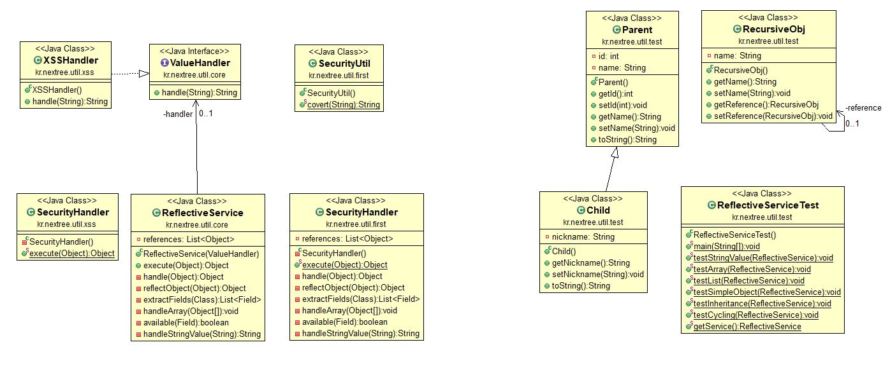

이 내용은 NEXTREE의 내용을 스크랩 하였습니다. 
[NEXTREE](http://www.nextree.co.kr/p3643/)

복잡한 구조를 가진 객체에서 문자열을 찾아 치환해야 하는 문제상황을 Java에서 제공하는 리플랙션(reflection) API를 이용하여 해결해 보았습니다.

# 문제상황
고객사인 OO보험은 소프트웨어 품질과 관련된 활동이 비교적 엄격한 편인데, 품질 기준을 통과해야만 운영서버로의 이관이 허용됩니다. 
시스템 개발이 마무리 단계에 이를 무렵 시스템의 보안심의를 통과하라는 요청이 왔는데, __지적된 사항은 XSS(cross-site scripting) 취약점 보완이었습니다.__ 
사용자 입력 값에 악성 스크립트를 동작시킬 수 있는 문자가 포함된 경우 안전한 문자로 치환하도록 처리하라는 것이 그 내용입니다. 
또한 이러한 작업은 반드시 서버 사이드에서 처리되어야만 합니다. 
이 내용을 적용하기 위한 몇 가지 방안을 논의하였습니다.

아키텍처의 공통 F/W (예, 전문변환 F/W)에서 해당 기능을 제공
Controller에서 서블릿 필터를 구현하여 요청된 JSON 전문의 문자열 치환
서비스 컴포넌트의 각 오퍼레이션에서 문자열 치환

첫째, 공통 F/W에서 해당기능을 제공하는 것은 관련 부서의 일정상의 이유로 거절되었습니다. 

둘째, 이미 개발된 서비스 오퍼레이션이 매우 많음을 감안할 때, 서블릿 필터를 이용하는 방법이 매우 합리적인 대안으로 생각되었으나 이 방법 또한 아키텍처에서 Controller 영역을 확장하는 것을 제한하고 있어 적용할 수 없었습니다.

결국 마지막 방안이었던 서비스의 각 오퍼레이션에서 보안 처리를 위한 코드를 적용하는 것으로 결정하였습니다. 
요청 파라미터가 문자열인 경우는 큰 문제는 없었으나 __파라미터가 구조화된 객체인 경우__ 업무 로직이 위치하는 곳에 보안 처리를 위한 코드를 추가하는 것은 큰 부담이 되었습니다. 

[코드1]
```
public void saveCustomer(Customer customer) {  
    // 보안 처리를 위한 코드
    if (customer != null) {
        customer.setName(SecurityUtil.convert(customer.getName()));
        // ...
        if (customer.getAddress() != null) {
           Address address = customer.getAddress();
           address.setCity(SecurityUtil.convert(address.getCity());
           address.setDetailAddress(SecurityUtil.convert(address.getDetailAddress));
        }
        // ...
    }

    // 이하 업무 코드
}
```
[코드1] 복잡한 객체 구조에서 getter/setter를 사용하여 문자열 치환

[코드1]과 같이 업무로직만큼이나 보안 처리를 위한 로직이 많아지면서 코드가 매우 지저분해졌습니다. 
보안 처리 코드를 별도의 메소드로 분리하여 해결할 수도 있지만 보다 근본적으로 이러한 코드를 최소화하는 방안을 찾아 보았습니다.

# 객체구조탐색의 대안 - 리플랙션(Reflection)

대부분의 객체지향 프로그래밍 언어에서는 객체가 속한 타입을 추적할 수 있도록 객체들에 대한 RTTI(Runtime Type Identification, 런타임 타입 식별정보)를 관리합니다. 
Java 역시 RTTI를 사용하는 언어 중의 하나이며, JVM은 런타임 타입정보를 통해 정확한 메소드를 찾아내어 실행합니다.

Java는 런타임 타입정보를 담고 있는 특수한 클래스를 제공하는데 그것은 Class 클래스입니다. 
객체에서 Class 클래스를 얻기 위해서는 getClass() 메소드를 호출합니다. 
Class 클래스를 이용하여 런타임에 객체의 타입을 알 수 있으며, 객체 필드의 값을 조회하거나 변경할 수도 있습니다. 
이와 같이 런타임에 타입정보를 다루는 것을 __리플랙션__ 이라 하며 java.lang.reflect 패키지에는 다양한 리플랙션과 관련된 API를 제공합니다.

리플랙션은 IDE와 같은 도구를 제작할 때나, 프레임워크를 만들 때 주로 활용됩니다. 
예를 들어 Spring Framework의 bean 설정에 정의한 클래스 정보나 iBatis의 resultMap에 정의한 객체의 프로퍼티 정보가 실제로 동작하기 위해서는 리플랙션의 도움을 받아야 합니다.

# 보안처리 유틸리티 구현

유틸리티를 사용하는 클라이언트 측 코드 샘플은 [코드2]와 같습니다. 
보안 처리할 객체를 유틸리티에 전달하면 유틸리티 내에서 객체 안의 문자열을 찾아 치환합니다. 
[코드1]과 비교할 때, 단순한 처리만으로 보안기능을 추가할 수 있습니다.
```
public void saveCustomer(Customer customer) {  
    //
    SecurityHandler.execute(customer);

    //...
}
```
[코드2] 클라이언트 코드 샘플

클래스 다이어그램은 [그림2]와 같습니다. 
다양한 객체구조에서 문자열을 탐색하는 책임을 SecurityHandler가 가지며, 찾아낸 문자열의 치환은 앞서 만들어 놓은 SecurityUtil의 convert() 메소드를 호출합니다.


[그림2] 보안처리 유틸리티 설계

SecurityHandler의 handle(Object) method는 요청된 객체의 유형에 따라 문자열 치환을 수행할지 아니면 리플랙션을 사용하여 객체 필드를 조사할지를 결정합니다. 
특수한 형태의 객체인 배열에 대해서는 배열요소 각각에 대하여 handle() 메소드를 호출하여 처리합니다. 
이 때 객체가 배열인지 여부는 객체에서 Class 클래스를 얻어내어 isArray() 메소드를 호출하여 알 수 있습니다.

## obj.getClass().isArray()
```
private Object handle(Object obj) {  
    //
    if (obj == null) return null;

    if (obj instanceof String) { 
        return handleStringValue((String) obj);
    } else if (obj.getClass().isArray()) { 
        handleArray((Object[]) obj);
    } else {
        reflectObject(obj);
    }

    return obj;
}
```
[코드3] 객체 유형에 따라 처리방법을 결정하는 handle 메소드

문자열도 배열도 아닌 객체에 대해서는 객체의 필드를 하나씩 확인하여 처리할 필요가 있습니다. 
reflectObject() 메소드는 객체가 가진 모든 필드(상속관계 포함)를 추출하여 handle() 메소드를 호출합니다. 
handle() 메소드는 재귀적으로 호출되므로 결과적으로 객체 내부구조를 모두 탐색하게 됩니다. 
이때 __문자열이 아닌 primitive type이나 값을 변경할 수 없는 필드__ 는 리플랙션하지 않도록 처리하였습니다.

```
private Object reflectObject(Object obj) {  
    //
    List<Field> fields = extractFields(obj.getClass());
    for (Field field : fields) {
        if  (available(field)) {
            try {
                field.setAccessible(true);
                field.set(obj, handle(field.get(obj)));
            } catch (Exception e) {
                e.printStackTrace();
            }
        }
    }
    return obj;
}
```
[코드4] 객체의 내부구조를 탐색하는 reflectObject() 메소드

테스트 결과 몇 가지 문제점이 발견되었습니다. 

첫 째는 객체가 __순환참조__ 하고 있을 때입니다. 
객체에 대한 처리가 재귀적으로 호출되므로 끝없이 동일한 객체에 대하여 handle() 메소드가 호출되면서 결국 StackOverflowError가 발생하였습니다. 

두 번째는 __객체가 공유__ 되고 있는 상황입니다. 
여러 객체가 하나의 객체를 공유하고 있을 때, __공유된 객체의 문자열이 여러 번 처리__ 되는 문제가 있었습니다. 
예를 들어 보안 처리할 객체 A가 객체 B, C를 갖고 있고, 객체 B, C는 객체 D를 공유하고 있을 때, 객체 B를 탐색하면서 공유객체인 D의 문자열이 한번 치환되고 객체 C를 탐색하면서 또 치환됩니다.

> 객체 D의 문자열 : "less than <" → "less than &lt;" → "less than &amp;lt;" (oops!)

__두 가지 문제점은 모두 이미 처리된 객체를 다시 처리하면서 발생합니다.__
처리된 객체 레퍼런스를 보관하여 한번 처리한 객체는 중복 처리를 하지 않도록 보완하였습니다.

```
private Object handle(Object obj) {  
    //
    if (obj == null) return null;

    // 이미 처리된 객체는 skip
    if (references.contains(obj)) return obj; 

    if (obj instanceof String) { 
        return handleStringValue((String) obj);
    } else {
        // 중복처리 방지용
        references.add(obj);

        if (obj.getClass().isArray()) { 
            handleArray((Object[]) obj);
        } else {
            reflectObject(obj);
        }
    }

    return obj;
}
```
[코드5] 객체의 중복처리를 방지하도록 보완한 handle() 메소드


# 설계의 개선
앞서 구현한 유틸리티는 객체 내부를 탐색하는 로직과 보안처리를 위한 코드가 혼재되어 있어 수정이 발생할 때 프로그램이 깨지기 쉽습니다. 
또한 향후 이와 같이 객체 내부를 탐색하여 문자열을 처리하는 유사한 상황에 적용하고자 한다면 중복코드를 작성하거나 if/else 처리를 해야 합니다. 
두 경우 모두 올바른 설계라고 할 수 없습니다.

리플랙션을 사용하는 객체 내부를 탐색하는 로직과 보안처리와 관련된 문자열 치환 로직을 분리해 봅니다. 
개선된 설계를 통해 보안기준의 변경에 따라 문자열 치환 로직이 변경되어야 할 경우 XSSHandler를 수정하면 되고, 향후 새로운 유형의 문자열을 치환하는 모듈이 추가되더라도 쉽게 확장가능합니다.

# 마무리하며..
이번 글에서는 다양한 객체구조를 탐색해서 문자열을 치환하는 유틸리티를 리플랙션을 이용하여 구현해 보았습니다. 리플랙션은 분명 강력하고 복잡한 매커니즘을 제공합니다. 그러나 컴파일 시점에는 오류가 쉽게 발견되지 않으며, 런타임에 오류가 발생한 경우 디버깅이 쉽지 않은 단점이 있습니다. 이러한 이유로 비즈니스를 구현하는 응용프로그램에서는 직접적으로 사용하는 것을 권장하지 않습니다.하지만, 문제상황처럼 리플랙션을 도입할 때 얻을 수 있는 이점이 많은 상황이라면 설계를 개선하여 유지보수 및 확장성을 높이는 방향을 고려해 볼 수 있지 않을까요?

# 배움 
 이 글을 통하여 reflection의 장점을 살려 동적로딩 및 객체 인스턴스 구별을 알게 되었습니다.
 객체의 참조와 recursive를 다시 상기 시켜 로직 구성을 보다 우아하게 만들 수 있다는것을 코드를 통해 배울 수 있었습니다.
 if/else , switch와 같이 여러 분기점으로 나누지 않고 reflection으로 간편하게 class분석하여 문자 수정을 쉽게 할 수 있었습니다. 
 
